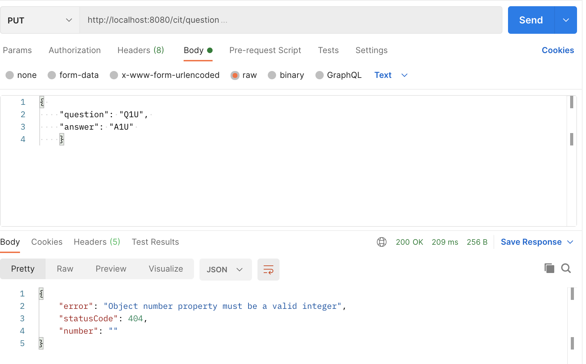

## File Overview:

- p4-data.js: Data source of question and answer objects.
- p4-module.js: A module of functions that retrieve a given question and/or answer based on the input.
- p4-server.js: The Fastify and Node.js server that calls functions from the p4-module.js to respond to GET, POST, PUT, and DELETE routes along with request parameters.
- package.json: Packages that are used in this project.

_-An example of a PUT request with an invalid Q and A that returns an error_
